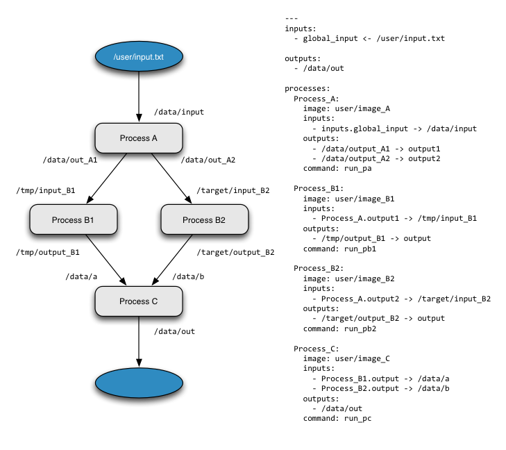

============
Introduction
============

At its heart, ``endofday`` is a workflow engine for ``docker`` containers. When we refer to a workflow, we mean an
orchestrated set of tasks or processes that together accomplish some larger objective. In the case of endofday,
the individual tasks are container invocations which means that virtually any Linux host can provide computational
resources in support of executing an endofday workflow. One of the great features of endofday is that you can easily
transition from executing your entire workflow on your personal machine, to executing part or all of it in a remote
cloud, freeing up your local resources for other tasks.

Each task within a workflow can have any number of inputs and outputs, and each input or output can be any file or
directory. By defining the input of one task to be the output of another task, a dependency can be created between two
tasks. The endofday engine analyzes the dependencies of all tasks within a workflow and executes the tasks in the proper
order, running tasks in parallel when possible.

Workflows for endofday are defined in a text file using the YAML_ format. The YAML definition includes a description of
each container that should be executed (the image, command to run, inputs and outputs) as well as the global inputs and
outputs of the workflow. This makes endofday workflows very easy to share and distribute. Thanks to Docker_, you can
execute the same workflow from one host to the next by simply copying the yml file to the new host. No additional
software installation is needed: if the images are not available locally, they will be pulled automatically from the
Docker hub when endofday executes.

Currently, endofday supports three modes of execution: *local*, *cloud*, and *hybrid*. With the local mode of execution, the
entire workflow is executed on the same host running the endofday binary itself. To support executing workflows in a
remote cloud, endofday leverages the Agave_ science-as-a-service platform. Using your Agave credentials, you can execute
an entire endofday workflow in Agave's cloud infrastructure and have the outputs automatically archived to an Agave
storage system you have pre-configured. Agave will send you an email when the job completes. Alternatively, with the
hybrid execution mode, you can specify individual containers to execute in the cloud while others execute locally. In
this case, inputs will be uploaded and outputs downloaded automatically by the endofday engine. In the tutorial we
cover each execution mode by working through specific examples.

.. _YAML: http://yaml.org/
.. _Docker: http://docker.com
.. _Agave: http://agaveapi.co
